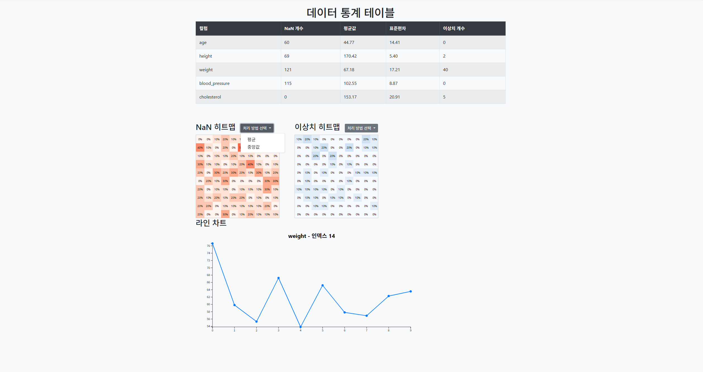

## 결측 및 이상치 데이터 분석

## 결측 및 이상치 데이터란?
- 결측 데이터
    - 데이터셋에서 특정 변수 또는 값이 기록되지 않았거나 누락된 상태
    - 누락 데이터가 적고, 패턴을 왜곡하지 않으면 삭제
    - 평균, 중앙값 등의 방법을 사용해 대체 (impution)

- 이상치 데이터
    - 데이터의 일반적인 패턴에서 크게 벗어난 값
    - 표준편차, Interquartile Range (IQR) 등을 통해 식별
    - 정규화, 평균, 중앙값 등의 방법을 사용해 대체 (impution)

## 결측 및 이상치 데이터 분석 실습
1. 데이터의 속성을 시각적으로 표현해 column별 결측 및 이상치 발견
2. “데이터의 특정 index에 결측 및 이상치가 많은가?”라는 질문 생성
3. “데이터 전체에 결측 및 이상치가 분포되어 있다”는 인사이트 도출
4. 결측 및 이상치 처리 전략 수립 (평균값 or 중앙값)
5. 대체된 데이터 확인 -> 대체된 데이터에 대한 새로운 이상치 발견
6. 추가 전략 수립 및 피드백 루프 과정 수행

## 결과
